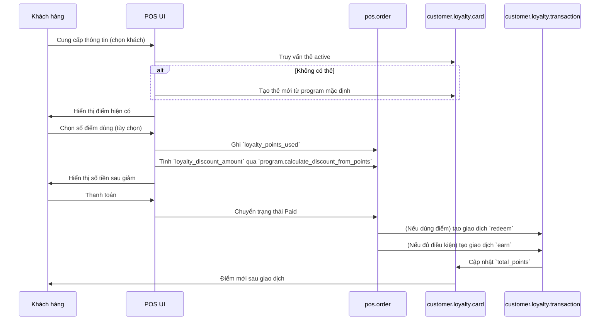
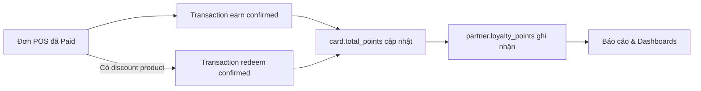
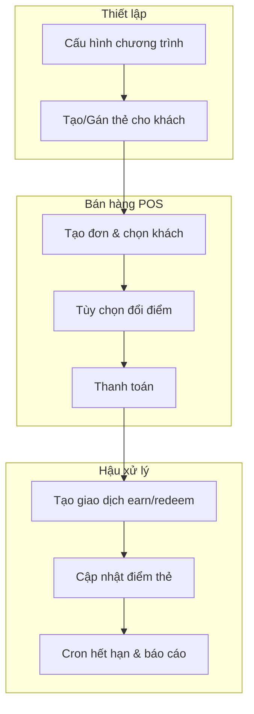

# Luồng Hoạt Động Chức Năng Tích Điểm

Tài liệu này mô tả chi tiết các bước vận hành của hệ thống tích điểm trong module `taphoa_management`, giúp bạn dễ dàng vẽ lại sơ đồ hoặc trao đổi với đội ngũ liên quan.

## 1. Tác nhân & Đối tượng liên quan

| Vai trò/Model | Vai trò chính |
| --- | --- |
| **Khách hàng (res.partner)** | Nhân vật sử dụng điểm, sở hữu thẻ |
| **Thu ngân/POS** | Khởi tạo đơn, áp dụng giảm giá từ điểm |
| **Chương trình (customer.loyalty.program)** | Lưu tỷ lệ tích/đổi, giới hạn giảm giá, hạn dùng |
| **Thẻ (customer.loyalty.card)** | Theo dõi tổng điểm từng khách |
| **Giao dịch (customer.loyalty.transaction)** | Log tích, đổi, điều chỉnh, hết hạn |
| **Cron hết hạn** | Tự động trừ điểm khi đến hạn |

## 2. Chuẩn bị chương trình & thẻ

```mermaid
flowchart TD
    A[Manager cấu hình chương trình\n(customer.loyalty.program)] --> B{Program active?}
    B -- No --> A
    B -- Yes --> C[Thu ngân tạo thẻ \nhoặc gọi partner.create_loyalty_card]
    C --> D[Lưu số thẻ LCxxxxx\n+ gắn chương trình]
    D --> E[Thẻ ở trạng thái active\n sẵn sàng dùng tại POS]
```

> Ghi nhớ: nếu khách chưa có thẻ, hàm `customer.loyalty.card.add_transaction` hoặc `pos.order.create` sẽ tự tạo thẻ mới từ chương trình active đầu tiên.

## 3. Luồng tại quầy POS



### Bước chi tiết

1. **Chọn khách hàng:** POS lấy `loyalty_card_id` active; nếu thiếu thì tạo tự động (sử dụng chương trình có `active=True`).
2. **Đổi điểm (tùy chọn):** trường `loyalty_points_used` được validate:
   - Không vượt `card.total_points`.
   - Không nhỏ hơn `program.min_points_to_redeem`.
   - Số tiền giảm giới hạn bởi `program.max_discount_percentage`.
3. **Thanh toán:** `pos.order.action_pos_order_paid()` gọi `_process_loyalty_points()`:
   - Tạo transaction `redeem` (âm điểm) nếu khách dùng điểm.
   - Tạo transaction `earn` với điểm tính từ `program.calculate_points_from_amount()` trên số tiền sau giảm.
4. **Cập nhật:** `customer.loyalty.card._compute_points()` làm mới tổng điểm, đồng thời `res.partner.loyalty_points` phản ánh ra POS.

## 4. Luồng hậu xử lý & đồng bộ



- `pos.order.loyalty_transaction_id` trỏ tới giao dịch earn cuối.
- In hóa đơn: `_prepare_invoice_vals` thêm diễn giải giảm giá từ điểm.
- Dashboard/Reports đọc từ các transaction và cards để tổng hợp.

## 5. Hết hạn & Điều chỉnh điểm

```mermaid
flowchart TD
    Cron[Hàng ngày: _cron_expire_points] --> Scan[Quét transaction earn đã quá hạn]
    Scan --> CreateExpire[Tạo transaction type "expire" (âm điểm)]
    CreateExpire --> MarkOld[Đánh dấu transaction gốc = expired]
    MarkOld --> CardUpdate[Card cập nhật total_points]
```

- Manager có thể tạo transaction `adjust` thủ công (tặng/trừ điểm) ở trạng thái nháp rồi **Confirm**.
- Hủy giao dịch chỉ thực hiện khi vẫn là `draft`.

## 6. Lưu đồ tổng quan (từ góc nhìn kinh doanh)



## 7. Mốc kiểm soát chính

- **Điểm vào**: `loyalty_points_used` (POS UI) và `order.amount_total`.
- **Điểm ra**: `customer.loyalty.transaction` (log) và `card.total_points`.
- **Rules**: lấy trực tiếp từ `customer.loyalty.program` (tỷ lệ tích, tỷ lệ quy đổi, hạn mức giảm, hạn dùng).
- **Automation**: `_cron_expire_points` bảo vệ việc tồn dư điểm quá hạn.

> Bạn có thể dùng các sơ đồ Mermaid trên trong bất kỳ trình hỗ trợ Mermaid (VS Code, Notion, GitBook...) để render thành flowchart hoặc sequence diagram.
